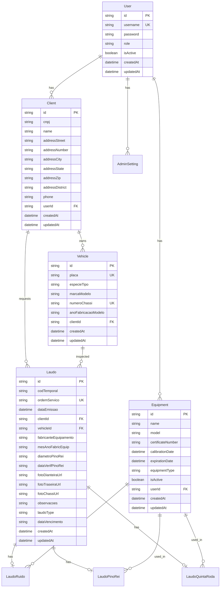

# 🗄️ Estrutura do Banco de Dados - Easy Laudos

## Índice
1. [Visão Geral](#visão-geral)
2. [Diagrama ER](#diagrama-er)
3. [Tabelas Principais](#tabelas-principais)
4. [Tabelas de Laudos](#tabelas-de-laudos)
5. [Enumerações](#enumerações)
6. [Relacionamentos](#relacionamentos)
7. [Índices e Constraints](#índices-e-constraints)
8. [Queries Importantes](#queries-importantes)
9. [Migrations](#migrations)
10. [Otimizações](#otimizações)

---

## 📊 Visão Geral

### Tecnologia
- **ORM**: Prisma 6.9.0
- **Banco de Dados**: SQLite (desenvolvimento/produção)
- **Provider**: sqlite (migrável para PostgreSQL/MySQL)
- **Localização**: `prisma/dev.db`

### Estatísticas
- **Total de Tabelas**: 9
- **Total de Enums**: 3
- **Relacionamentos**: 19
- **Índices Únicos**: 5

### Características
- IDs usando CUID (Collision-resistant Unique Identifier)
- Timestamps automáticos (createdAt, updatedAt)
- Soft delete não implementado (exclusão física)
- Multi-tenancy por usuário (userId)

---

## 📐 Diagrama ER



---

## 📋 Tabelas Principais

### 1. User
**Descrição**: Gerencia usuários do sistema com diferentes níveis de acesso

| Campo | Tipo | Constraints | Descrição |
|-------|------|------------|-----------|
| id | String | PK, CUID | Identificador único |
| username | String | UNIQUE | Nome de usuário para login |
| password | String | NOT NULL | Senha criptografada |
| role | String | NOT NULL | Papel: admin, client_a, client_b |
| isActive | Boolean | DEFAULT true | Status de ativação |
| createdAt | DateTime | AUTO | Data de criação |
| updatedAt | DateTime | AUTO | Última atualização |

**Relações**:
- 1:N com Client
- 1:N com Equipment
- 1:N com AdminSetting

---

### 2. Client
**Descrição**: Armazena informações dos clientes (empresas transportadoras)

| Campo | Tipo | Constraints | Descrição |
|-------|------|------------|-----------|
| id | String | PK, CUID | Identificador único |
| cnpj | String | NOT NULL | CNPJ da empresa |
| name | String | NOT NULL | Razão social |
| addressStreet | String | NULLABLE | Logradouro |
| addressNumber | String | NULLABLE | Número |
| addressCity | String | NULLABLE | Cidade |
| addressState | String | NULLABLE | Estado (UF) |
| addressZip | String | NULLABLE | CEP |
| addressDistrict | String | NULLABLE | Bairro |
| phone | String | NULLABLE | Telefone |
| userId | String | FK, NULLABLE | Usuário proprietário |
| createdAt | DateTime | AUTO | Data de criação |
| updatedAt | DateTime | AUTO | Última atualização |

**Índices Únicos**:
- `[cnpj, userId]` - CNPJ único por usuário

**Relações**:
- N:1 com User
- 1:N com Vehicle
- 1:N com Laudo

---

### 3. Vehicle
**Descrição**: Cadastro de veículos para inspeção

| Campo | Tipo | Constraints | Descrição |
|-------|------|------------|-----------|
| id | String | PK, CUID | Identificador único |
| placa | String | UNIQUE | Placa do veículo |
| especieTipo | String | NULLABLE | Espécie/Tipo |
| marcaModelo | String | NULLABLE | Marca e Modelo |
| numeroChassi | String | UNIQUE | Número do chassi |
| anoFabricacaoModelo | String | NULLABLE | Ano fab./modelo |
| clientId | String | FK | Cliente proprietário |
| createdAt | DateTime | AUTO | Data de criação |
| updatedAt | DateTime | AUTO | Última atualização |

**Relações**:
- N:1 com Client
- 1:N com Laudo

---

### 4. Equipment
**Descrição**: Equipamentos de medição calibrados

| Campo | Tipo | Constraints | Descrição |
|-------|------|------------|-----------|
| id | String | PK, CUID | Identificador único |
| name | String | NOT NULL | Nome (ex: AKSO) |
| model | String | NOT NULL | Modelo (ex: AK824) |
| certificateNumber | String | NOT NULL | Número do certificado |
| calibrationDate | DateTime | NOT NULL | Data de calibração |
| expirationDate | DateTime | NOT NULL | Data de vencimento |
| equipmentType | String | NOT NULL | DECIBELIMETRO, CALIBRADOR, OUTROS |
| isActive | Boolean | DEFAULT true | Status de ativação |
| userId | String | FK, NULLABLE | Usuário proprietário |
| createdAt | DateTime | AUTO | Data de criação |
| updatedAt | DateTime | AUTO | Última atualização |

**Índices Únicos**:
- `[certificateNumber, userId]` - Certificado único por usuário

**Relações**:
- N:1 com User
- 1:N com LaudoRuido
- 1:N com LaudoPinoRei
- 1:N com LaudoQuintaRoda

---

### 5. AdminSetting
**Descrição**: Configurações administrativas por usuário

| Campo | Tipo | Constraints | Descrição |
|-------|------|------------|-----------|
| id | String | PK, CUID | Identificador único |
| companyName | String | NULLABLE | Nome da empresa |
| companyTaxId | String | NULLABLE | CNPJ/CPF |
| companyAddress | String | NULLABLE | Endereço completo |
| companyPhone | String | NULLABLE | Telefone |
| companyLogoUrl | String | NULLABLE | URL do logo |
| reportTitle | String | DEFAULT | Título do laudo |
| userId | String | FK, NULLABLE | null=admin, valor=client_a/client_b |
| updatedAt | DateTime | AUTO | Última atualização |

**Relações**:
- N:1 com User

---

## 🔬 Tabelas de Laudos

### 6. Laudo (Principal)
**Descrição**: Tabela mestre de laudos de inspeção

| Campo | Tipo | Constraints | Descrição |
|-------|------|------------|-----------|
| id | String | PK, CUID | Identificador único |
| codTemporal | String | NULLABLE | Código temporal |
| ordemServico | String | UNIQUE | Número da OS |
| dataEmissao | DateTime | NOT NULL | Data de emissão |
| clientId | String | FK | Cliente do laudo |
| vehicleId | String | FK | Veículo inspecionado |
| fabricanteEquipamento | String | DEFAULT "N.A" | Fabricante |
| mesAnoFabricEquip | String | DEFAULT "N.A" | Mês/Ano fabricação |
| diametroPinoRei | String | DEFAULT "N.A" | Diâmetro pino rei |
| dataVerifPinoRei | String | NULLABLE | Data verificação |
| fotoDianteiraUrl | String | NULLABLE | Foto dianteira |
| fotoTraseiraUrl | String | NULLABLE | Foto traseira |
| fotoChassiUrl | String | NULLABLE | Foto do chassi |
| observacoes | String | NULLABLE | Observações |
| laudoType | String | NOT NULL | CHECKLIST, LIT, RUIDO, PINO_REI, QUINTA_RODA |
| dataVencimento | String | NULLABLE | Data de vencimento |
| createdAt | DateTime | AUTO | Data de criação |
| updatedAt | DateTime | AUTO | Última atualização |

**Relações**:
- N:1 com Client
- N:1 com Vehicle
- 1:1 com LaudoRuido (opcional)
- 1:1 com LaudoPinoRei (opcional)
- 1:1 com LaudoQuintaRoda (opcional)

---

### 7. LaudoRuido
**Descrição**: Dados específicos do laudo de ruído

| Campo | Tipo | Constraints | Descrição |
|-------|------|------------|-----------|
| id | String | PK, CUID | Identificador único |
| laudoId | String | FK, UNIQUE | Laudo principal |
| equipmentId | String | FK | Equipamento usado |
| aceleracao1-6 | Decimal | NOT NULL | Medições aceleração (0-120 dB) |
| marchaLenta1-6 | Decimal | NOT NULL | Medições marcha lenta (0-120 dB) |
| medianaAceleracao | Decimal | NULLABLE | Mediana calculada |
| maxAceleracao | Decimal | NULLABLE | Máximo aceleração |
| medianaMarchaLenta | Decimal | NULLABLE | Mediana marcha lenta |
| maxMarchaLenta | Decimal | NULLABLE | Máximo marcha lenta |
| resultado | String | NOT NULL | APROVADO/REPROVADO |
| inspetorResponsavel | String | NOT NULL | Nome do inspetor |
| createdAt | DateTime | AUTO | Data de criação |
| updatedAt | DateTime | AUTO | Última atualização |

**Relações**:
- 1:1 com Laudo
- N:1 com Equipment

---

### 8. LaudoPinoRei
**Descrição**: Dados específicos do laudo de pino rei

| Campo | Tipo | Constraints | Descrição |
|-------|------|------------|-----------|
| id | String | PK, CUID | Identificador único |
| laudoId | String | FK, UNIQUE | Laudo principal |
| equipmentId | String | FK | Equipamento usado |
| dataValidadeInspecao | String | NOT NULL | DD/MM/AAAA |
| **Exame Visual Pino Rei** |
| posicaoVertical | Boolean | NOT NULL | Posição vertical |
| presencaTrincas | Boolean | NOT NULL | Presença de trincas |
| integridadeFixacao | Boolean | NOT NULL | Integridade fixação |
| seloIdentificacao | Boolean | NOT NULL | Selo identificação |
| tipoFixacaoPino | Enum | NOT NULL | SOLDA, FLANGEADO, APARAFUSADA |
| diametroRegistrado | Decimal | NOT NULL | Diâmetro em mm |
| estadoConservacao | Boolean | NOT NULL | Estado conservação |
| resultadoPinoRei | Enum | NOT NULL | APROVADO/REPROVADO |
| **Inspeção Mesa** |
| tipoFixacaoMesa | Enum | NOT NULL | SOLDA, APARAFUSADA |
| mesaBemFixada | Boolean | NOT NULL | Mesa bem fixada |
| mesaReparoSolda | Boolean | NOT NULL | Reparo por solda |
| resultadoMesa | Enum | NOT NULL | APROVADO/REPROVADO |
| **Ensaios** |
| ensaioComplementar | Boolean | NOT NULL | Ensaio realizado |
| qualEnsaio | String | NULLABLE | Descrição ensaio |
| **Resultado** |
| resultadoGeral | Enum | NOT NULL | APROVADO/REPROVADO |
| **Fotos** |
| fotoChassiUrl | String | NULLABLE | Foto chassi |
| fotoPinoReiUrl | String | NULLABLE | Foto pino rei |
| fotoMesaUrl | String | NULLABLE | Foto mesa |
| **Outros** |
| observacoes | String | NULLABLE | Observações |
| normasAplicaveis | String | NOT NULL | Normas aplicadas |
| inspetorResponsavel | String | NOT NULL | Nome inspetor |
| createdAt | DateTime | AUTO | Data criação |
| updatedAt | DateTime | AUTO | Última atualização |

**Relações**:
- 1:1 com Laudo
- N:1 com Equipment

---

### 9. LaudoQuintaRoda
**Descrição**: Dados específicos do laudo de quinta roda

| Campo | Tipo | Constraints | Descrição |
|-------|------|------------|-----------|
| id | String | PK, CUID | Identificador único |
| laudoId | String | FK, UNIQUE | Laudo principal |
| equipmentId | String | FK | Equipamento usado |
| dataValidadeInspecao | String | NOT NULL | DD/MM/AAAA |
| **Dados Quinta Roda** |
| fabricanteMarca | String | NOT NULL | Fabricante/Marca |
| modelo | String | NOT NULL | Modelo |
| numeroIdentificacao | String | NOT NULL | Número identificação |
| **12 Itens Exame Visual** |
| seloIdentificacao | Boolean | NOT NULL | Selo conformidade |
| presencaTrincas | Boolean | NOT NULL | Trincas/rachaduras |
| integraFixada | Boolean | NOT NULL | Íntegra e fixada |
| pinosIntegros | Boolean | NOT NULL | Pinos íntegros |
| mancaisOvalados | Boolean | NOT NULL | Mancais ovalados |
| mecanismoTravamento | Boolean | NOT NULL | Mecanismo travamento |
| pinosPressos | Boolean | NOT NULL | Pinos presos |
| desgastesCanais | Boolean | NOT NULL | Desgastes canais |
| apoiosSapatas | Boolean | NOT NULL | Apoios/sapatas |
| cantoneirasFixadas | Boolean | NOT NULL | Cantoneiras fixadas |
| aterramentoFixado | Boolean | NOT NULL | Aterramento fixado |
| ensaioComplementar | Boolean | NOT NULL | Ensaio complementar |
| **Resultado** |
| resultadoFinal | Enum | NOT NULL | APROVADO/REPROVADO |
| **Fotos** |
| fotoQuintaRoda1Url | String | NULLABLE | Foto 1 quinta roda |
| fotoQuintaRoda2Url | String | NULLABLE | Foto 2 quinta roda |
| fotoChassiUrl | String | NULLABLE | Foto chassi |
| **Outros** |
| observacoes | String | NULLABLE | Observações |
| normasAplicaveis | String | NOT NULL | Normas aplicadas |
| inspetorResponsavel | String | NOT NULL | Nome inspetor |
| createdAt | DateTime | AUTO | Data criação |
| updatedAt | DateTime | AUTO | Última atualização |

**Relações**:
- 1:1 com Laudo
- N:1 com Equipment

---

## 🔢 Enumerações

### TipoFixacaoPino
```prisma
enum TipoFixacaoPino {
  SOLDA
  FLANGEADO
  APARAFUSADA
}
```

### TipoFixacaoMesa
```prisma
enum TipoFixacaoMesa {
  SOLDA
  APARAFUSADA
}
```

### ResultadoInspecao
```prisma
enum ResultadoInspecao {
  APROVADO
  REPROVADO
}
```

---

## 🔗 Relacionamentos

### Diagrama de Cardinalidade
```
User (1) ---- (*) Client
User (1) ---- (*) Equipment
User (1) ---- (*) AdminSetting

Client (1) ---- (*) Vehicle
Client (1) ---- (*) Laudo

Vehicle (1) ---- (*) Laudo

Laudo (1) ---- (0..1) LaudoRuido
Laudo (1) ---- (0..1) LaudoPinoRei
Laudo (1) ---- (0..1) LaudoQuintaRoda

Equipment (1) ---- (*) LaudoRuido
Equipment (1) ---- (*) LaudoPinoRei
Equipment (1) ---- (*) LaudoQuintaRoda
```

### Integridade Referencial
- **CASCADE DELETE**: Não implementado (proteção de dados)
- **SET NULL**: Não utilizado
- **RESTRICT**: Comportamento padrão

---

## 🔍 Índices e Constraints

### Índices Únicos
1. **User.username** - Login único no sistema
2. **Vehicle.placa** - Placa única
3. **Vehicle.numeroChassi** - Chassi único
4. **Laudo.ordemServico** - OS única
5. **[Client.cnpj, Client.userId]** - CNPJ único por usuário
6. **[Equipment.certificateNumber, Equipment.userId]** - Certificado único por usuário

### Índices Compostos
```sql
-- Índice para busca de clientes por usuário
CREATE INDEX idx_client_user ON Client(userId);

-- Índice para busca de laudos por cliente
CREATE INDEX idx_laudo_client ON Laudo(clientId);

-- Índice para busca de laudos por veículo
CREATE INDEX idx_laudo_vehicle ON Laudo(vehicleId);

-- Índice para busca de laudos por tipo
CREATE INDEX idx_laudo_type ON Laudo(laudoType);

-- Índice para busca de laudos por data
CREATE INDEX idx_laudo_date ON Laudo(dataEmissao);
```

---

## 📝 Queries Importantes

### 1. Buscar Laudos com Relacionamentos
```javascript
// Buscar laudo completo com todos os dados
const laudo = await prisma.laudo.findUnique({
  where: { id: laudoId },
  include: {
    client: true,
    vehicle: true,
    laudoRuido: {
      include: { equipment: true }
    },
    laudoPinoRei: {
      include: { equipment: true }
    },
    laudoQuintaRoda: {
      include: { equipment: true }
    }
  }
});
```

### 2. Relatório de Laudos por Período
```javascript
// Laudos emitidos no mês
const laudos = await prisma.laudo.findMany({
  where: {
    dataEmissao: {
      gte: startOfMonth,
      lte: endOfMonth
    },
    userId: userId // Multi-tenancy
  },
  include: {
    client: true,
    vehicle: true
  },
  orderBy: {
    dataEmissao: 'desc'
  }
});
```

### 3. Verificar Equipamentos Vencidos
```javascript
// Equipamentos com calibração vencida
const equipmentosVencidos = await prisma.equipment.findMany({
  where: {
    expirationDate: {
      lt: new Date()
    },
    isActive: true,
    userId: userId
  }
});
```

### 4. Dashboard Analytics
```javascript
// Estatísticas gerais
const stats = await prisma.$transaction([
  prisma.laudo.count({ where: { userId } }),
  prisma.client.count({ where: { userId } }),
  prisma.vehicle.count({ where: { client: { userId } } }),
  prisma.equipment.count({ where: { userId, isActive: true } })
]);
```

### 5. Multi-tenancy Query
```javascript
// Todos os queries devem filtrar por userId
const clients = await prisma.client.findMany({
  where: {
    OR: [
      { userId: null }, // Admin vê todos
      { userId: currentUserId } // User vê apenas seus
    ]
  }
});
```

---

## 🔄 Migrations

### Estrutura de Migrations
```
prisma/
├── migrations/
│   ├── 20240101000000_init/
│   │   └── migration.sql
│   ├── 20240102000000_add_user_system/
│   │   └── migration.sql
│   └── migration_lock.toml
└── schema.prisma
```

### Comandos de Migration
```bash
# Criar nova migration
npx prisma migrate dev --name nome_da_migration

# Aplicar migrations pendentes
npx prisma migrate deploy

# Reset do banco (CUIDADO!)
npx prisma migrate reset

# Status das migrations
npx prisma migrate status

# Resolver migrations com problema
npx prisma migrate resolve --applied "20240101000000_init"
```

### Migration para PostgreSQL
```prisma
// Alterar no schema.prisma
datasource db {
  provider = "postgresql"
  url      = env("DATABASE_URL")
}

// Ajustar tipos se necessário
// String @db.Text para textos longos
// DateTime @db.Timestamptz para timezone
```

---

## ⚡ Otimizações

### 1. Índices Recomendados
```sql
-- Performance de busca
CREATE INDEX idx_laudo_search ON Laudo(ordemServico, dataEmissao);
CREATE INDEX idx_client_search ON Client(cnpj, name);
CREATE INDEX idx_vehicle_search ON Vehicle(placa, numeroChassi);

-- Performance de relatórios
CREATE INDEX idx_laudo_report ON Laudo(laudoType, dataEmissao, clientId);
CREATE INDEX idx_equipment_active ON Equipment(isActive, expirationDate);
```

### 2. Otimização de Queries
```javascript
// Usar select para campos específicos
const laudos = await prisma.laudo.findMany({
  select: {
    id: true,
    ordemServico: true,
    dataEmissao: true,
    client: {
      select: {
        name: true,
        cnpj: true
      }
    }
  }
});

// Usar findFirst ao invés de findMany[0]
const firstLaudo = await prisma.laudo.findFirst({
  where: { clientId },
  orderBy: { dataEmissao: 'desc' }
});
```

### 3. Batch Operations
```javascript
// Inserção em lote
await prisma.laudo.createMany({
  data: laudosArray,
  skipDuplicates: true
});

// Update em lote
await prisma.laudo.updateMany({
  where: { clientId },
  data: { status: 'ARCHIVED' }
});
```

### 4. Transações
```javascript
// Operações atômicas
const result = await prisma.$transaction(async (tx) => {
  const laudo = await tx.laudo.create({ data: laudoData });
  const laudoRuido = await tx.laudoRuido.create({
    data: { ...ruidoData, laudoId: laudo.id }
  });
  return { laudo, laudoRuido };
});
```

### 5. Cache Strategy
```javascript
// Implementar cache para dados estáticos
const CACHE_TTL = 3600; // 1 hora

// Equipamentos ativos (mudam pouco)
const cachedEquipments = await cache.get('equipments') || 
  await prisma.equipment.findMany({
    where: { isActive: true }
  });
```

---

## 📊 Métricas e Monitoramento

### Queries para Monitoramento
```sql
-- Tamanho do banco
SELECT page_count * page_size as size FROM pragma_page_count(), pragma_page_size();

-- Tabelas maiores
SELECT name, COUNT(*) as rows FROM sqlite_master 
WHERE type='table' GROUP BY name;

-- Índices não utilizados
SELECT name FROM sqlite_master 
WHERE type='index' AND name NOT IN (
  SELECT DISTINCT index_name FROM sqlite_stat1
);
```

### Health Checks
```javascript
// Verificar conexão
await prisma.$queryRaw`SELECT 1`;

// Verificar integridade
await prisma.$queryRaw`PRAGMA integrity_check`;

// Verificar foreign keys
await prisma.$queryRaw`PRAGMA foreign_key_check`;
```

---

## 🔒 Segurança

### Boas Práticas
1. **Sempre usar Prepared Statements** (Prisma faz automaticamente)
2. **Validar inputs** antes de queries
3. **Implementar rate limiting** para queries pesadas
4. **Usar transações** para operações críticas
5. **Backup regular** do banco de dados

### SQL Injection Prevention
```javascript
// NUNCA faça isso
const unsafe = await prisma.$queryRawUnsafe(
  `SELECT * FROM User WHERE id = ${userId}`
);

// Sempre faça isso
const safe = await prisma.user.findUnique({
  where: { id: userId }
});

// Ou com queryRaw
const safeRaw = await prisma.$queryRaw`
  SELECT * FROM User WHERE id = ${userId}
`;
```

---

## 📚 Referências

- [Prisma Documentation](https://www.prisma.io/docs)
- [SQLite Documentation](https://www.sqlite.org/docs.html)
- [Schema Design Best Practices](https://www.prisma.io/docs/guides/database/database-schema-design)
- [Performance Optimization](https://www.prisma.io/docs/guides/performance-and-optimization)

---

*Última atualização: Janeiro 2024*
*Versão do documento: 1.0.0*