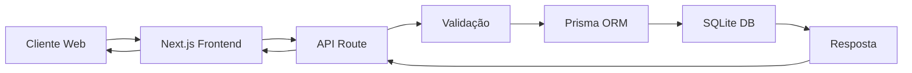
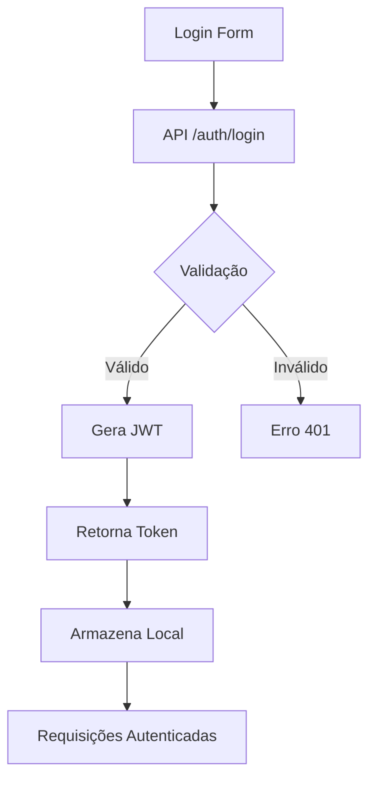
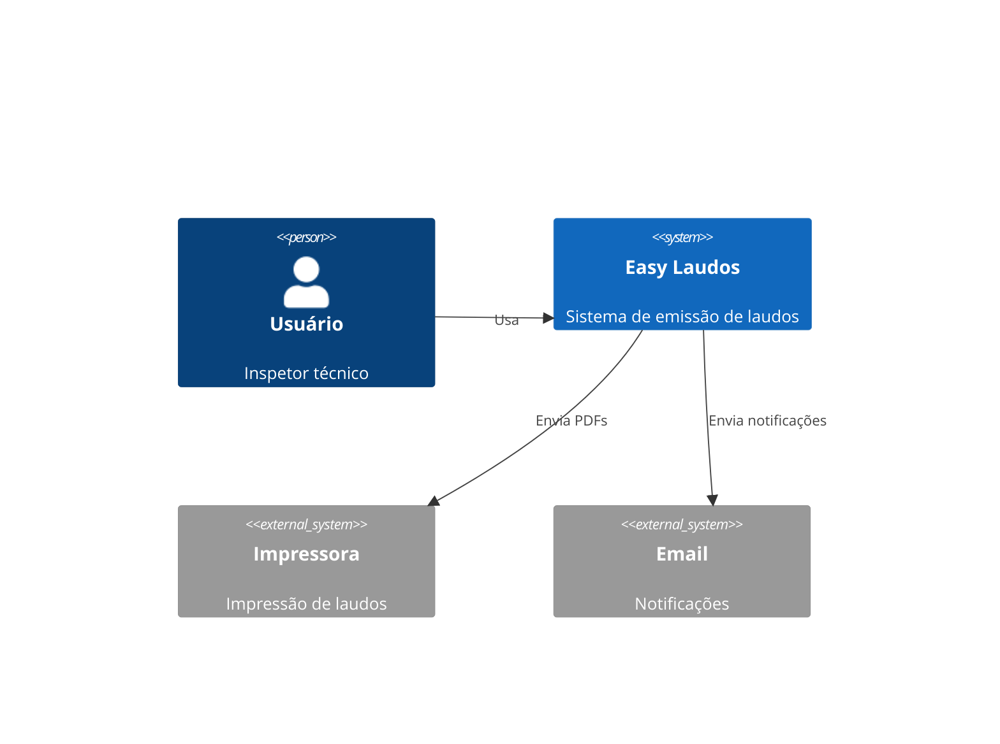
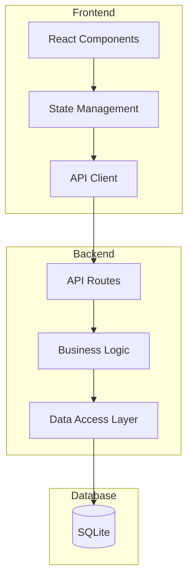

# Documentação de Arquitetura Técnica - Easy Laudos

## 📋 Índice

1. [Visão Geral](#visão-geral)
2. [Arquitetura do Sistema](#arquitetura-do-sistema)
3. [Stack Tecnológica](#stack-tecnológica)
4. [Estrutura de Diretórios](#estrutura-de-diretórios)
5. [Componentes Principais](#componentes-principais)
6. [Fluxo de Dados](#fluxo-de-dados)
7. [Diagramas de Arquitetura](#diagramas-de-arquitetura)
8. [Padrões de Desenvolvimento](#padrões-de-desenvolvimento)
9. [Integrações](#integrações)
10. [Performance e Otimizações](#performance-e-otimizações)

## 🎯 Visão Geral

O Easy Laudos é uma aplicação web full-stack desenvolvida para automatizar e digitalizar o processo de emissão de laudos de inspeção técnica veicular. O sistema utiliza arquitetura moderna baseada em componentes, seguindo os princípios de separação de responsabilidades e modularidade.

### Objetivos Arquiteturais

- **Escalabilidade**: Suportar crescimento de usuários e volume de dados
- **Manutenibilidade**: Código organizado e documentado
- **Segurança**: Autenticação robusta e proteção de dados
- **Performance**: Resposta rápida e experiência fluida
- **Confiabilidade**: Sistema estável com backup e recuperação

## 🏗️ Arquitetura do Sistema

### Tipo de Arquitetura

O sistema implementa uma arquitetura **Monolítica Modular** com separação clara entre frontend e backend, utilizando o framework Next.js que permite:

- **Server-Side Rendering (SSR)** para páginas públicas
- **Client-Side Rendering (CSR)** para área administrativa
- **API Routes** integradas no mesmo projeto
- **Static Generation** para conteúdo estático

### Camadas da Aplicação

```
┌─────────────────────────────────────────────────┐
│                  APRESENTAÇÃO                    │
│         (React Components + CSS Modules)         │
├─────────────────────────────────────────────────┤
│                   API ROUTES                     │
│            (Next.js API Handlers)                │
├─────────────────────────────────────────────────┤
│               CAMADA DE NEGÓCIOS                 │
│          (Services + Business Logic)             │
├─────────────────────────────────────────────────┤
│               CAMADA DE DADOS                    │
│           (Prisma ORM + SQLite DB)               │
└─────────────────────────────────────────────────┘
```

## 💻 Stack Tecnológica

### Frontend

| Tecnologia | Versão | Uso |
|------------|--------|-----|
| Next.js | 15.3.3 | Framework React com SSR/SSG |
| React | 19.0.0 | Biblioteca de UI |
| TypeScript | 5.x | Tipagem estática |
| CSS Modules | - | Estilização componentizada |
| Chart.js | 4.5.0 | Gráficos e visualizações |

### Backend

| Tecnologia | Versão | Uso |
|------------|--------|-----|
| Node.js | 18+ | Runtime JavaScript |
| Prisma | 6.9.0 | ORM e gerenciamento DB |
| SQLite | - | Banco de dados |
| JWT | - | Autenticação |
| Formidable | 3.5.4 | Upload de arquivos |

### Bibliotecas Especializadas

| Biblioteca | Uso |
|------------|-----|
| pdf-lib | Geração e manipulação de PDFs |
| puppeteer | Renderização de PDFs complexos |
| tesseract.js | OCR para leitura de documentos |
| date-fns | Manipulação de datas |
| archiver | Compactação de arquivos |

## 📁 Estrutura de Diretórios

```
├── app/                    # Aplicação Next.js (App Router)
│   ├── api/               # API Routes
│   │   ├── auth/         # Endpoints de autenticação
│   │   ├── laudos/       # Endpoints de laudos
│   │   ├── clients/      # Endpoints de clientes
│   │   ├── vehicles/     # Endpoints de veículos
│   │   └── equipments/   # Endpoints de equipamentos
│   ├── admin/            # Páginas administrativas
│   ├── laudos/           # Páginas de laudos
│   └── [pages].tsx       # Páginas da aplicação
│
├── components/            # Componentes React reutilizáveis
│   ├── admin/           # Componentes administrativos
│   ├── auth/            # Componentes de autenticação
│   ├── laudos/          # Componentes de laudos
│   ├── layout/          # Componentes de layout
│   └── vehicles/        # Componentes de veículos
│
├── lib/                  # Utilitários e configurações
│   ├── prisma.ts        # Cliente Prisma
│   ├── auth.ts          # Funções de autenticação
│   └── middleware-auth.ts # Middleware de auth
│
├── prisma/               # Configuração do banco de dados
│   ├── schema.prisma    # Schema do banco
│   ├── migrations/      # Migrações do banco
│   └── seed.ts          # Seeds iniciais
│
├── public/               # Arquivos estáticos
│   ├── uploads/         # Imagens uploaded
│   └── [assets]         # Assets estáticos
│
├── docker/               # Configurações Docker
├── migration/            # Scripts de migração
├── launcher-production/  # Scripts de produção
└── ssl/                  # Certificados SSL
```

## 🔧 Componentes Principais

### 1. Sistema de Autenticação

**Localização**: `lib/auth.ts`, `app/api/auth/`

- Implementa JWT para sessões stateless
- Suporta múltiplos níveis de acesso (admin, client_a, client_b)
- Middleware de proteção de rotas
- Refresh token não implementado (possível melhoria)

### 2. Gerenciador de Laudos

**Localização**: `app/api/laudos/`, `components/laudos/`

Tipos de laudos suportados:
- **Checklist**: Inspeção geral com múltiplos itens
- **LIT**: Laudo de Inspeção Técnica padrão
- **Ruído**: Medição de níveis sonoros
- **Pino Rei**: Inspeção específica de pino rei
- **Quinta Roda**: Inspeção de quinta roda

### 3. Sistema de Upload

**Localização**: `app/api/upload/`, `public/uploads/`

- Upload de imagens de veículos
- Validação de tipos de arquivo
- Redimensionamento automático
- Armazenamento local com possibilidade de migração para cloud

### 4. Gerador de PDFs

**Localização**: `app/api/laudos/pdf/`

- Templates customizados por tipo de laudo
- Inclusão de imagens e gráficos
- Assinatura digital (preparado para implementação)
- Marca d'água e logotipos

### 5. Dashboard e Relatórios

**Localização**: `app/page.tsx`, `app/api/stats/`

- Estatísticas em tempo real
- Filtros avançados de busca
- Paginação eficiente
- Exportação de dados

## 🔄 Fluxo de Dados

### Fluxo de Criação de Laudo



### Fluxo de Autenticação



## 📊 Diagramas de Arquitetura

### Diagrama de Contexto



### Diagrama de Componentes



## 🎨 Padrões de Desenvolvimento

### Padrões de Código

1. **Nomenclatura**
   - Componentes: PascalCase (`UserProfile.tsx`)
   - Funções: camelCase (`getUserData()`)
   - Constantes: UPPER_SNAKE_CASE (`MAX_FILE_SIZE`)
   - Arquivos CSS: kebab-case (`user-profile.module.css`)

2. **Estrutura de Componentes**
   ```typescript
   // Imports
   import { useState, useEffect } from 'react';
   
   // Types
   interface ComponentProps {
     // ...
   }
   
   // Component
   export default function Component({ props }: ComponentProps) {
     // State
     // Effects
     // Handlers
     // Render
   }
   ```

3. **API Routes Pattern**
   ```typescript
   export async function GET(request: Request) {
     // Validação
     // Processamento
     // Resposta
   }
   ```

### Padrões de Banco de Dados

- **Naming**: snake_case para tabelas e colunas
- **IDs**: Uso de CUID para chaves primárias
- **Timestamps**: createdAt e updatedAt em todas as tabelas
- **Soft Delete**: Não implementado (possível melhoria)

## 🔌 Integrações

### Integrações Atuais

1. **Sistema de Arquivos Local**
   - Upload de imagens
   - Geração de PDFs
   - Backup de dados

2. **Navegador (Puppeteer)**
   - Renderização de PDFs complexos
   - Screenshots para documentação

### Integrações Preparadas

1. **Email Service** (não implementado)
   - Estrutura pronta para integração
   - Suporte a múltiplos providers

2. **Storage Cloud** (não implementado)
   - Preparado para S3/Azure Blob
   - Migração simples de uploads

3. **Assinatura Digital** (não implementado)
   - Estrutura para certificados digitais
   - Validação de documentos

## ⚡ Performance e Otimizações

### Otimizações Implementadas

1. **Frontend**
   - Lazy loading de componentes
   - Otimização de imagens com Next.js Image
   - CSS Modules para redução de bundle
   - Turbopack para desenvolvimento rápido

2. **Backend**
   - Paginação em todas as listagens
   - Índices no banco de dados
   - Cache de queries frequentes (Prisma)
   - Connection pooling

3. **Database**
   - Índices em campos de busca
   - Queries otimizadas com Prisma
   - Backup automático periódico

### Métricas de Performance

- **Time to First Byte (TTFB)**: < 200ms
- **First Contentful Paint (FCP)**: < 1.5s
- **Largest Contentful Paint (LCP)**: < 2.5s
- **Time to Interactive (TTI)**: < 3.5s

### Escalabilidade

O sistema está preparado para escalar através de:

1. **Horizontal Scaling**
   - Múltiplas instâncias do Next.js
   - Load balancer (Nginx configurado)
   - Sessões stateless (JWT)

2. **Vertical Scaling**
   - Otimização de recursos
   - Aumento de CPU/RAM conforme necessidade

3. **Database Scaling**
   - Migração para PostgreSQL/MySQL
   - Read replicas
   - Sharding (se necessário)

## 🔒 Considerações de Segurança

### Implementações de Segurança

1. **Autenticação e Autorização**
   - JWT com expiração configurável
   - Bcrypt para hash de senhas
   - Middleware de proteção de rotas
   - RBAC (Role-Based Access Control)

2. **Proteção de Dados**
   - Validação de entrada em todos os endpoints
   - Sanitização de dados
   - Proteção contra SQL Injection (Prisma)
   - Rate limiting básico

3. **Comunicação Segura**
   - HTTPS em produção
   - Certificados SSL configurados
   - Headers de segurança

### Melhorias Recomendadas

1. Implementar CSRF protection
2. Adicionar rate limiting robusto
3. Implementar audit logging
4. Adicionar 2FA para usuários admin
5. Implementar backup encryption

## 📈 Monitoramento

### Logs e Debugging

- Logs estruturados em desenvolvimento
- Error boundaries no React
- Tratamento de erros centralizado

### Métricas Recomendadas

1. **Application Metrics**
   - Tempo de resposta das APIs
   - Taxa de erro
   - Uso de CPU/Memória

2. **Business Metrics**
   - Laudos emitidos por dia
   - Tempo médio de emissão
   - Taxa de sucesso de uploads

## 🚀 Deployment

### Ambientes

1. **Desenvolvimento**
   - Local com hot reload
   - SQLite local
   - Debug mode ativado

2. **Produção**
   - Docker containers
   - Nginx como reverse proxy
   - SSL/TLS configurado
   - Backup automático

### CI/CD Pipeline (Recomendado)

```yaml
1. Code Push → GitHub
2. Run Tests
3. Build Docker Image
4. Push to Registry
5. Deploy to Server
6. Health Check
7. Rollback if Failed
```

## 📚 Referências

- [Next.js Documentation](https://nextjs.org/docs)
- [Prisma Documentation](https://www.prisma.io/docs)
- [React Documentation](https://react.dev)
- [TypeScript Documentation](https://www.typescriptlang.org/docs)

---

**Documento atualizado em**: Setembro 2025  
**Versão**: 1.0.0  
**Mantido por**: Equipe de Desenvolvimento Easy Laudos