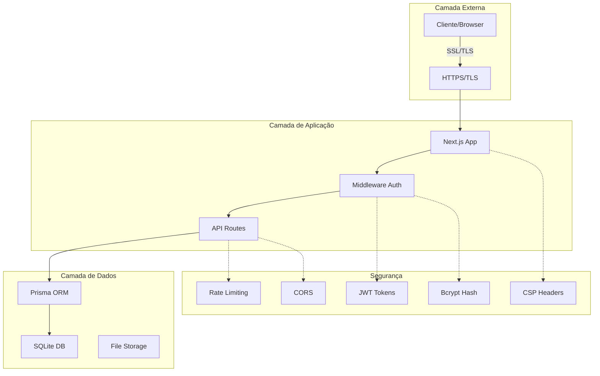
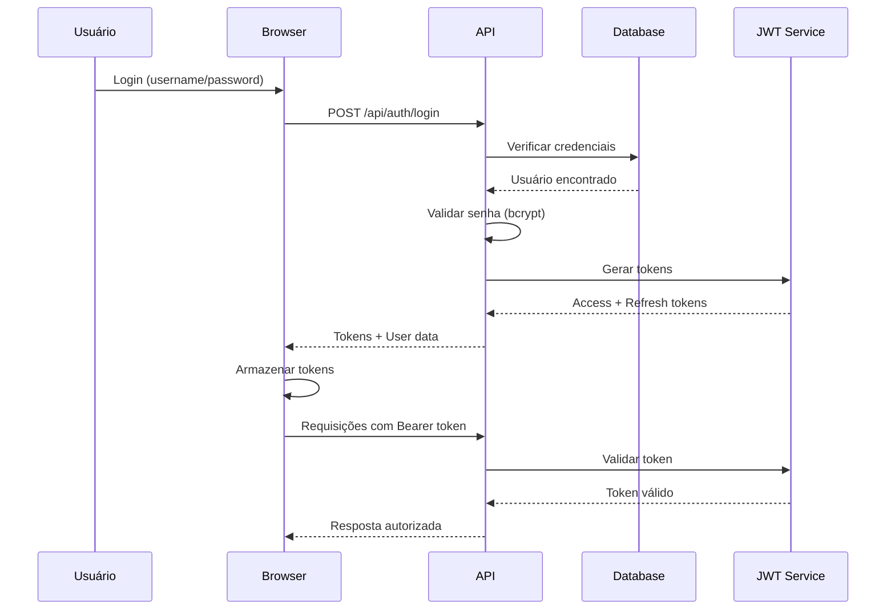

# 🔐 Segurança e Autenticação - Easy Laudos

## Índice
1. [Visão Geral de Segurança](#visão-geral-de-segurança)
2. [Sistema de Autenticação](#sistema-de-autenticação)
3. [Autorização e Controle de Acesso](#autorização-e-controle-de-acesso)
4. [Criptografia e Proteção de Dados](#criptografia-e-proteção-de-dados)
5. [Segurança da API](#segurança-da-api)
6. [Proteção contra Ataques](#proteção-contra-ataques)
7. [Auditoria e Logs](#auditoria-e-logs)
8. [Conformidade e Regulamentos](#conformidade-e-regulamentos)
9. [Backup e Recuperação](#backup-e-recuperação)
10. [Checklist de Segurança](#checklist-de-segurança)

---

## 🛡️ Visão Geral de Segurança

### Arquitetura de Segurança


### Princípios de Segurança Implementados
1. **Defense in Depth** - Múltiplas camadas de segurança
2. **Principle of Least Privilege** - Acesso mínimo necessário
3. **Zero Trust** - Verificação contínua
4. **Secure by Default** - Configurações seguras padrão
5. **Data Protection** - Criptografia em repouso e trânsito

---

## 🔑 Sistema de Autenticação

### 1. Fluxo de Autenticação


### 2. Estrutura do JWT Token
```javascript
// Header
{
  "alg": "HS256",
  "typ": "JWT"
}

// Payload
{
  "userId": "cuid_do_usuario",
  "username": "admin",
  "role": "admin",
  "iat": 1704067200,
  "exp": 1704070800,
  "iss": "easy-laudos",
  "sub": "authentication"
}

// Signature
HMACSHA256(
  base64UrlEncode(header) + "." +
  base64UrlEncode(payload),
  JWT_SECRET
)
```

### 3. Configuração de Tokens
```typescript
// config/auth.ts
export const AUTH_CONFIG = {
  jwt: {
    accessTokenExpiry: '1h',      // Token de acesso: 1 hora
    refreshTokenExpiry: '7d',     // Token de refresh: 7 dias
    issuer: 'easy-laudos',
    algorithm: 'HS256'
  },
  session: {
    maxAge: 24 * 60 * 60,         // 24 horas
    updateAge: 60 * 60,           // Atualizar a cada 1 hora
    secure: process.env.NODE_ENV === 'production',
    httpOnly: true,
    sameSite: 'strict'
  },
  password: {
    minLength: 8,
    requireUppercase: true,
    requireLowercase: true,
    requireNumbers: true,
    requireSpecialChars: true,
    saltRounds: 10
  }
};
```

### 4. Implementação de Login
```typescript
// app/api/auth/login/route.ts
import bcrypt from 'bcryptjs';
import jwt from 'jsonwebtoken';

export async function POST(request: Request) {
  const { username, password } = await request.json();
  
  // 1. Buscar usuário
  const user = await prisma.user.findUnique({
    where: { username }
  });
  
  if (!user || !user.isActive) {
    return Response.json(
      { error: 'Credenciais inválidas' },
      { status: 401 }
    );
  }
  
  // 2. Verificar senha
  const isValidPassword = await bcrypt.compare(
    password,
    user.password
  );
  
  if (!isValidPassword) {
    // Log tentativa falha
    await logFailedAttempt(username);
    return Response.json(
      { error: 'Credenciais inválidas' },
      { status: 401 }
    );
  }
  
  // 3. Gerar tokens
  const accessToken = jwt.sign(
    {
      userId: user.id,
      username: user.username,
      role: user.role
    },
    process.env.JWT_SECRET!,
    { expiresIn: '1h' }
  );
  
  const refreshToken = jwt.sign(
    { userId: user.id },
    process.env.JWT_REFRESH_SECRET!,
    { expiresIn: '7d' }
  );
  
  // 4. Retornar resposta
  return Response.json({
    user: {
      id: user.id,
      username: user.username,
      role: user.role
    },
    accessToken,
    refreshToken
  });
}
```

### 5. Middleware de Autenticação
```typescript
// middleware/auth.ts
import { NextRequest, NextResponse } from 'next/server';
import jwt from 'jsonwebtoken';

export async function authMiddleware(request: NextRequest) {
  const token = request.headers.get('authorization')?.split(' ')[1];
  
  if (!token) {
    return NextResponse.json(
      { error: 'Token não fornecido' },
      { status: 401 }
    );
  }
  
  try {
    const decoded = jwt.verify(
      token,
      process.env.JWT_SECRET!
    ) as JWTPayload;
    
    // Adicionar usuário ao request
    const requestHeaders = new Headers(request.headers);
    requestHeaders.set('x-user-id', decoded.userId);
    requestHeaders.set('x-user-role', decoded.role);
    
    return NextResponse.next({
      request: {
        headers: requestHeaders,
      },
    });
  } catch (error) {
    return NextResponse.json(
      { error: 'Token inválido' },
      { status: 401 }
    );
  }
}
```

---

## 👮 Autorização e Controle de Acesso

### 1. Sistema de Roles (RBAC)
```typescript
// types/auth.ts
export enum UserRole {
  ADMIN = 'admin',
  CLIENT_A = 'client_a',
  CLIENT_B = 'client_b'
}

export interface Permission {
  resource: string;
  actions: string[];
}

export const ROLE_PERMISSIONS: Record<UserRole, Permission[]> = {
  [UserRole.ADMIN]: [
    { resource: '*', actions: ['*'] } // Acesso total
  ],
  [UserRole.CLIENT_A]: [
    { resource: 'clients', actions: ['create', 'read', 'update'] },
    { resource: 'vehicles', actions: ['create', 'read', 'update'] },
    { resource: 'laudos', actions: ['create', 'read', 'update'] },
    { resource: 'equipment', actions: ['read'] }
  ],
  [UserRole.CLIENT_B]: [
    { resource: 'clients', actions: ['create', 'read', 'update'] },
    { resource: 'vehicles', actions: ['create', 'read', 'update'] },
    { resource: 'laudos', actions: ['create', 'read', 'update'] },
    { resource: 'equipment', actions: ['read'] }
  ]
};
```

### 2. Middleware de Autorização
```typescript
// middleware/authorization.ts
export function requireRole(...allowedRoles: UserRole[]) {
  return async (request: NextRequest) => {
    const userRole = request.headers.get('x-user-role');
    
    if (!userRole || !allowedRoles.includes(userRole as UserRole)) {
      return NextResponse.json(
        { error: 'Acesso negado' },
        { status: 403 }
      );
    }
    
    return NextResponse.next();
  };
}

// Uso
export async function GET(request: NextRequest) {
  // Apenas admin pode acessar
  const authCheck = await requireRole(UserRole.ADMIN)(request);
  if (authCheck.status !== 200) return authCheck;
  
  // Lógica do endpoint...
}
```

### 3. Multi-tenancy por Usuário
```typescript
// utils/multitenancy.ts
export async function filterByUser(
  query: any,
  userId: string,
  userRole: string
) {
  if (userRole === 'admin') {
    // Admin vê todos os registros
    return query;
  }
  
  // Outros usuários veem apenas seus registros
  return {
    ...query,
    where: {
      ...query.where,
      OR: [
        { userId: null },  // Registros públicos
        { userId: userId } // Registros do usuário
      ]
    }
  };
}
```

---

## 🔒 Criptografia e Proteção de Dados

### 1. Criptografia de Senhas
```typescript
// utils/crypto.ts
import bcrypt from 'bcryptjs';
import crypto from 'crypto';

// Hash de senha
export async function hashPassword(password: string): Promise<string> {
  const salt = await bcrypt.genSalt(10);
  return bcrypt.hash(password, salt);
}

// Verificar senha
export async function verifyPassword(
  password: string,
  hash: string
): Promise<boolean> {
  return bcrypt.compare(password, hash);
}

// Criptografia simétrica para dados sensíveis
const algorithm = 'aes-256-gcm';
const key = Buffer.from(process.env.ENCRYPTION_KEY!, 'base64');

export function encrypt(text: string): string {
  const iv = crypto.randomBytes(16);
  const cipher = crypto.createCipheriv(algorithm, key, iv);
  
  let encrypted = cipher.update(text, 'utf8', 'hex');
  encrypted += cipher.final('hex');
  
  const authTag = cipher.getAuthTag();
  
  return iv.toString('hex') + ':' + 
         authTag.toString('hex') + ':' + 
         encrypted;
}

export function decrypt(encryptedData: string): string {
  const parts = encryptedData.split(':');
  const iv = Buffer.from(parts[0], 'hex');
  const authTag = Buffer.from(parts[1], 'hex');
  const encrypted = parts[2];
  
  const decipher = crypto.createDecipheriv(algorithm, key, iv);
  decipher.setAuthTag(authTag);
  
  let decrypted = decipher.update(encrypted, 'hex', 'utf8');
  decrypted += decipher.final('utf8');
  
  return decrypted;
}
```

### 2. Proteção de Dados Sensíveis
```typescript
// models/secure-data.ts
export class SecureDataHandler {
  // Mascarar CNPJ
  static maskCNPJ(cnpj: string): string {
    return cnpj.replace(/(\d{2})(\d{3})(\d{3})(\d{4})(\d{2})/, 
                        '$1.***.***/****-$5');
  }
  
  // Mascarar dados pessoais
  static maskPersonalData(data: any): any {
    return {
      ...data,
      cnpj: this.maskCNPJ(data.cnpj),
      phone: data.phone?.replace(/(\d{2})(\d{5})(\d{4})/, 
                                 '$1 *****-$3'),
      address: data.address ? '***' : null
    };
  }
  
  // Sanitizar input
  static sanitizeInput(input: string): string {
    return input
      .replace(/[<>]/g, '') // Remove HTML tags
      .replace(/javascript:/gi, '') // Remove javascript:
      .replace(/on\w+=/gi, '') // Remove event handlers
      .trim();
  }
}
```

---

## 🌐 Segurança da API

### 1. Headers de Segurança
```typescript
// middleware.ts
export function middleware(request: NextRequest) {
  const response = NextResponse.next();
  
  // Security Headers
  response.headers.set('X-Frame-Options', 'DENY');
  response.headers.set('X-Content-Type-Options', 'nosniff');
  response.headers.set('X-XSS-Protection', '1; mode=block');
  response.headers.set('Referrer-Policy', 'strict-origin-when-cross-origin');
  response.headers.set('Permissions-Policy', 
    'camera=(), microphone=(), geolocation=()');
  
  // Content Security Policy
  response.headers.set('Content-Security-Policy', 
    "default-src 'self'; " +
    "script-src 'self' 'unsafe-inline' 'unsafe-eval'; " +
    "style-src 'self' 'unsafe-inline'; " +
    "img-src 'self' data: blob:; " +
    "font-src 'self' data:; " +
    "connect-src 'self'; " +
    "frame-ancestors 'none';"
  );
  
  // HSTS
  if (process.env.NODE_ENV === 'production') {
    response.headers.set('Strict-Transport-Security', 
      'max-age=31536000; includeSubDomains; preload');
  }
  
  return response;
}
```

### 2. Rate Limiting
```typescript
// utils/rate-limit.ts
import { LRUCache } from 'lru-cache';

type Options = {
  uniqueTokenPerInterval?: number;
  interval?: number;
};

export function rateLimit(options?: Options) {
  const tokenCache = new LRUCache({
    max: options?.uniqueTokenPerInterval || 500,
    ttl: options?.interval || 60000,
  });

  return {
    check: (req: Request, limit: number, token: string) =>
      new Promise<void>((resolve, reject) => {
        const tokenCount = (tokenCache.get(token) as number[]) || [0];
        if (tokenCount[0] === 0) {
          tokenCache.set(token, [1]);
        }
        tokenCount[0] += 1;

        const currentUsage = tokenCount[0];
        const isRateLimited = currentUsage > limit;
        
        if (isRateLimited) {
          reject(new Error('Rate limit exceeded'));
        } else {
          tokenCache.set(token, tokenCount);
          resolve();
        }
      }),
  };
}

// Uso
const limiter = rateLimit({
  interval: 60 * 1000, // 1 minuto
  uniqueTokenPerInterval: 500,
});

export async function POST(request: Request) {
  try {
    await limiter.check(request, 10, 'CACHE_TOKEN');
  } catch {
    return Response.json(
      { error: 'Too many requests' },
      { status: 429 }
    );
  }
  
  // Processar requisição...
}
```

### 3. CORS Configuration
```typescript
// utils/cors.ts
export const corsHeaders = {
  'Access-Control-Allow-Origin': process.env.ALLOWED_ORIGINS || '*',
  'Access-Control-Allow-Methods': 'GET, POST, PUT, DELETE, OPTIONS',
  'Access-Control-Allow-Headers': 'Content-Type, Authorization',
  'Access-Control-Max-Age': '86400',
};

export async function handleCORS(request: Request) {
  // Handle preflight requests
  if (request.method === 'OPTIONS') {
    return new Response(null, {
      status: 200,
      headers: corsHeaders,
    });
  }
  
  // Add CORS headers to response
  return corsHeaders;
}
```

---

## 🛡️ Proteção contra Ataques

### 1. SQL Injection Prevention
```typescript
// ✅ CORRETO - Usando Prisma (prepared statements automáticos)
const user = await prisma.user.findUnique({
  where: { id: userId }
});

// ❌ ERRADO - SQL direto vulnerável
const query = `SELECT * FROM User WHERE id = '${userId}'`;

// ✅ CORRETO - Se precisar SQL raw
const user = await prisma.$queryRaw`
  SELECT * FROM User WHERE id = ${userId}
`;
```

### 2. XSS Prevention
```typescript
// utils/xss-protection.ts
import DOMPurify from 'isomorphic-dompurify';

export function sanitizeHTML(dirty: string): string {
  return DOMPurify.sanitize(dirty, {
    ALLOWED_TAGS: ['b', 'i', 'em', 'strong', 'a'],
    ALLOWED_ATTR: ['href']
  });
}

export function escapeHtml(unsafe: string): string {
  return unsafe
    .replace(/&/g, "&amp;")
    .replace(/</g, "&lt;")
    .replace(/>/g, "&gt;")
    .replace(/"/g, "&quot;")
    .replace(/'/g, "&#039;");
}
```

### 3. CSRF Protection
```typescript
// utils/csrf.ts
import crypto from 'crypto';

export function generateCSRFToken(): string {
  return crypto.randomBytes(32).toString('hex');
}

export function validateCSRFToken(
  token: string,
  sessionToken: string
): boolean {
  return crypto.timingSafeEqual(
    Buffer.from(token),
    Buffer.from(sessionToken)
  );
}

// Middleware CSRF
export async function csrfProtection(request: Request) {
  if (['POST', 'PUT', 'DELETE'].includes(request.method)) {
    const token = request.headers.get('x-csrf-token');
    const sessionToken = await getSessionToken(request);
    
    if (!token || !validateCSRFToken(token, sessionToken)) {
      return Response.json(
        { error: 'Invalid CSRF token' },
        { status: 403 }
      );
    }
  }
  
  return null;
}
```

### 4. File Upload Security
```typescript
// utils/file-security.ts
import { promises as fs } from 'fs';
import path from 'path';
import crypto from 'crypto';

const ALLOWED_EXTENSIONS = ['.pdf', '.jpg', '.jpeg', '.png'];
const MAX_FILE_SIZE = 10 * 1024 * 1024; // 10MB

export async function secureFileUpload(
  file: File,
  uploadDir: string
): Promise<string> {
  // 1. Verificar tamanho
  if (file.size > MAX_FILE_SIZE) {
    throw new Error('Arquivo muito grande');
  }
  
  // 2. Verificar extensão
  const ext = path.extname(file.name).toLowerCase();
  if (!ALLOWED_EXTENSIONS.includes(ext)) {
    throw new Error('Tipo de arquivo não permitido');
  }
  
  // 3. Verificar MIME type
  const buffer = await file.arrayBuffer();
  const fileType = await detectFileType(Buffer.from(buffer));
  
  if (!isValidMimeType(fileType, ext)) {
    throw new Error('Tipo de arquivo inválido');
  }
  
  // 4. Gerar nome único
  const uniqueName = crypto.randomBytes(16).toString('hex') + ext;
  const filePath = path.join(uploadDir, uniqueName);
  
  // 5. Salvar arquivo
  await fs.writeFile(filePath, Buffer.from(buffer));
  
  // 6. Scan antivírus (se configurado)
  await scanFile(filePath);
  
  return uniqueName;
}
```

---

## 📝 Auditoria e Logs

### 1. Sistema de Logs
```typescript
// utils/logger.ts
import winston from 'winston';

const logger = winston.createLogger({
  level: process.env.LOG_LEVEL || 'info',
  format: winston.format.json(),
  defaultMeta: { service: 'easy-laudos' },
  transports: [
    new winston.transports.File({ 
      filename: 'logs/error.log', 
      level: 'error' 
    }),
    new winston.transports.File({ 
      filename: 'logs/combined.log' 
    }),
    new winston.transports.File({
      filename: 'logs/security.log',
      level: 'warn'
    })
  ],
});

// Log de segurança
export function logSecurityEvent(
  event: string,
  userId: string,
  details: any
) {
  logger.warn('SECURITY_EVENT', {
    event,
    userId,
    timestamp: new Date().toISOString(),
    ip: details.ip,
    userAgent: details.userAgent,
    ...details
  });
}

// Log de acesso
export function logAccess(
  userId: string,
  resource: string,
  action: string,
  result: 'success' | 'failure'
) {
  logger.info('ACCESS_LOG', {
    userId,
    resource,
    action,
    result,
    timestamp: new Date().toISOString()
  });
}
```

### 2. Auditoria de Dados
```typescript
// models/audit.prisma
model AuditLog {
  id          String   @id @default(cuid())
  userId      String
  action      String   // CREATE, UPDATE, DELETE
  entity      String   // Client, Vehicle, Laudo, etc
  entityId    String
  oldValues   Json?
  newValues   Json?
  ip          String?
  userAgent   String?
  createdAt   DateTime @default(now())
}

// utils/audit.ts
export async function createAuditLog(
  userId: string,
  action: string,
  entity: string,
  entityId: string,
  oldValues?: any,
  newValues?: any
) {
  await prisma.auditLog.create({
    data: {
      userId,
      action,
      entity,
      entityId,
      oldValues,
      newValues,
      ip: getClientIP(),
      userAgent: getUserAgent()
    }
  });
}
```

---

## 📋 Conformidade e Regulamentos

### 1. LGPD Compliance
```typescript
// utils/lgpd.ts
export class LGPDCompliance {
  // Anonimização de dados
  static anonymizeUser(user: any) {
    return {
      ...user,
      username: 'ANONIMIZADO',
      password: null,
      email: 'anonimo@exemplo.com',
      phone: null,
      address: null
    };
  }
  
  // Exportar dados do usuário
  static async exportUserData(userId: string) {
    const userData = await prisma.user.findUnique({
      where: { id: userId },
      include: {
        clients: true,
        equipments: true,
        adminSettings: true
      }
    });
    
    return {
      exportDate: new Date().toISOString(),
      data: userData
    };
  }
  
  // Deletar dados do usuário
  static async deleteUserData(userId: string) {
    // Criar backup antes de deletar
    const backup = await this.exportUserData(userId);
    await saveBackup(backup);
    
    // Deletar em cascata
    await prisma.$transaction([
      prisma.client.deleteMany({ where: { userId } }),
      prisma.equipment.deleteMany({ where: { userId } }),
      prisma.adminSetting.deleteMany({ where: { userId } }),
      prisma.user.delete({ where: { id: userId } })
    ]);
  }
}
```

### 2. Política de Retenção
```typescript
// config/retention.ts
export const RETENTION_POLICY = {
  laudos: 5 * 365, // 5 anos
  logs: 90,        // 90 dias
  backups: 30,     // 30 dias
  sessions: 7,     // 7 dias
  tempFiles: 1     // 1 dia
};

// Cron job para limpeza
export async function cleanupOldData() {
  const now = new Date();
  
  // Limpar logs antigos
  const logCutoff = new Date(
    now.getTime() - RETENTION_POLICY.logs * 24 * 60 * 60 * 1000
  );
  
  await prisma.auditLog.deleteMany({
    where: {
      createdAt: { lt: logCutoff }
    }
  });
  
  // Arquivar laudos antigos
  const laudoCutoff = new Date(
    now.getTime() - RETENTION_POLICY.laudos * 24 * 60 * 60 * 1000
  );
  
  const oldLaudos = await prisma.laudo.findMany({
    where: {
      createdAt: { lt: laudoCutoff }
    }
  });
  
  for (const laudo of oldLaudos) {
    await archiveLaudo(laudo);
  }
}
```

---

## 💾 Backup e Recuperação

### 1. Estratégia de Backup
```bash
#!/bin/bash
# scripts/backup-security.sh

# Configurações
BACKUP_DIR="/secure/backups"
DB_FILE="./prisma/dev.db"
TIMESTAMP=$(date +%Y%m%d_%H%M%S)
ENCRYPTION_KEY=$BACKUP_ENCRYPTION_KEY

# Criar backup
echo "Iniciando backup seguro..."
mkdir -p $BACKUP_DIR

# 1. Backup do banco
sqlite3 $DB_FILE ".backup $BACKUP_DIR/db_$TIMESTAMP.db"

# 2. Backup de arquivos
tar -czf $BACKUP_DIR/files_$TIMESTAMP.tar.gz uploads/ logs/

# 3. Criptografar backups
openssl enc -aes-256-cbc -salt \
  -in $BACKUP_DIR/db_$TIMESTAMP.db \
  -out $BACKUP_DIR/db_$TIMESTAMP.db.enc \
  -k $ENCRYPTION_KEY

openssl enc -aes-256-cbc -salt \
  -in $BACKUP_DIR/files_$TIMESTAMP.tar.gz \
  -out $BACKUP_DIR/files_$TIMESTAMP.tar.gz.enc \
  -k $ENCRYPTION_KEY

# 4. Remover arquivos não criptografados
rm $BACKUP_DIR/db_$TIMESTAMP.db
rm $BACKUP_DIR/files_$TIMESTAMP.tar.gz

# 5. Upload para cloud (opcional)
aws s3 cp $BACKUP_DIR/db_$TIMESTAMP.db.enc \
  s3://backup-bucket/easy-laudos/

echo "Backup concluído: $TIMESTAMP"
```

### 2. Plano de Recuperação
```bash
#!/bin/bash
# scripts/restore-security.sh

# Configurações
BACKUP_FILE=$1
ENCRYPTION_KEY=$BACKUP_ENCRYPTION_KEY

# 1. Descriptografar backup
openssl enc -aes-256-cbc -d \
  -in $BACKUP_FILE \
  -out temp_restore.db \
  -k $ENCRYPTION_KEY

# 2. Validar integridade
sqlite3 temp_restore.db "PRAGMA integrity_check;"

if [ $? -eq 0 ]; then
  # 3. Fazer backup do banco atual
  mv prisma/dev.db prisma/dev.db.old
  
  # 4. Restaurar
  mv temp_restore.db prisma/dev.db
  
  # 5. Reiniciar aplicação
  pm2 restart easy-laudos
  
  echo "Restauração concluída com sucesso"
else
  echo "Erro: Backup corrompido"
  rm temp_restore.db
  exit 1
fi
```

---

## ✅ Checklist de Segurança

### Desenvolvimento
- [ ] Todas as senhas são hasheadas com bcrypt
- [ ] JWT tokens têm expiração configurada
- [ ] Validação de input em todos os endpoints
- [ ] Sanitização de dados antes de salvar
- [ ] Escape de output para prevenir XSS
- [ ] Prepared statements para queries SQL
- [ ] HTTPS em produção
- [ ] Headers de segurança configurados
- [ ] CORS configurado corretamente
- [ ] Rate limiting implementado
- [ ] CSRF protection ativo
- [ ] Logs de segurança ativos

### Deployment
- [ ] Variáveis de ambiente seguras
- [ ] Secrets únicos e fortes
- [ ] Firewall configurado
- [ ] Portas desnecessárias fechadas
- [ ] SSL/TLS certificado válido
- [ ] Backup automático configurado
- [ ] Monitoramento ativo
- [ ] Plano de recuperação testado
- [ ] Auditoria de segurança realizada

### Operacional
- [ ] Política de senhas implementada
- [ ] Sessões com timeout
- [ ] Bloqueio após tentativas falhas
- [ ] 2FA disponível (futuro)
- [ ] Logs revisados regularmente
- [ ] Updates de segurança aplicados
- [ ] Testes de penetração realizados
- [ ] Treinamento de segurança para equipe

### Conformidade
- [ ] LGPD compliance
- [ ] Política de privacidade
- [ ] Termos de uso
- [ ] Consentimento de dados
- [ ] Direito ao esquecimento
- [ ] Exportação de dados
- [ ] Retenção de dados configurada
- [ ] Anonimização implementada

---

## 🚨 Resposta a Incidentes

### 1. Plano de Resposta
```typescript
// utils/incident-response.ts
export class IncidentResponse {
  static async handleSecurityIncident(
    type: 'BREACH' | 'ATTACK' | 'LEAK',
    details: any
  ) {
    // 1. Isolar problema
    await this.isolateIssue(type, details);
    
    // 2. Notificar responsáveis
    await this.notifyTeam(type, details);
    
    // 3. Coletar evidências
    const evidence = await this.collectEvidence(details);
    
    // 4. Mitigar danos
    await this.mitigateDamage(type, details);
    
    // 5. Documentar incidente
    await this.documentIncident(type, details, evidence);
    
    // 6. Revisar e melhorar
    await this.schedulePostMortem(type);
  }
  
  static async isolateIssue(type: string, details: any) {
    if (type === 'BREACH') {
      // Bloquear usuário comprometido
      await prisma.user.update({
        where: { id: details.userId },
        data: { isActive: false }
      });
      
      // Invalidar tokens
      await invalidateAllTokens(details.userId);
    }
  }
}
```

### 2. Contatos de Emergência
```javascript
const SECURITY_CONTACTS = {
  cto: {
    name: "CTO",
    email: "cto@empresa.com",
    phone: "+55 11 9999-9999"
  },
  security: {
    name: "Security Team",
    email: "security@empresa.com",
    phone: "+55 11 8888-8888"
  },
  legal: {
    name: "Legal",
    email: "legal@empresa.com",
    phone: "+55 11 7777-7777"
  }
};
```

---

## 📚 Referências e Recursos

### Documentação
- [OWASP Top 10](https://owasp.org/www-project-top-ten/)
- [Next.js Security](https://nextjs.org/docs/authentication)
- [JWT Best Practices](https://tools.ietf.org/html/rfc8725)
- [LGPD Guidelines](https://www.gov.br/cidadania/pt-br/acesso-a-informacao/lgpd)

### Ferramentas de Segurança
- **SAST**: SonarQube, ESLint Security Plugin
- **DAST**: OWASP ZAP, Burp Suite
- **Dependency Check**: npm audit, Snyk
- **Secrets Scan**: GitGuardian, TruffleHog

### Comandos Úteis
```bash
# Verificar vulnerabilidades
npm audit

# Corrigir vulnerabilidades
npm audit fix

# Verificar dependências desatualizadas
npm outdated

# Scan de segurança
npx snyk test

# Verificar secrets no código
npx trufflehog filesystem .
```

---

*Última atualização: Janeiro 2024*
*Versão do documento: 1.0.0*
*Classificação: CONFIDENCIAL*